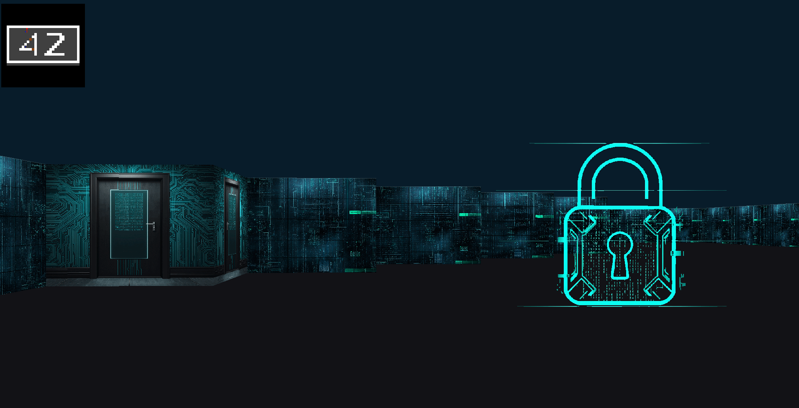
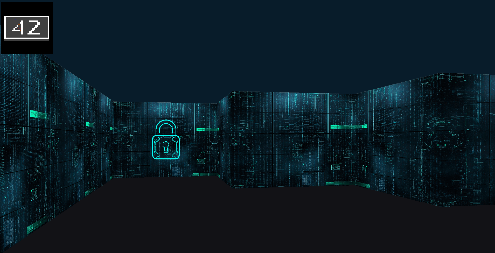

# Cub3D 

<div align="center">


**A 3D game engine built with raycasting, inspired by Wolfenstein 3D**

*Explore the maze from a first-person perspective* 🎮

</div>




## 📑 Table of Contents

- [Description](#-description)
- [Features](#-features)
- [Installation](#️-installation)
  - [Prerequisites](#prerequisites)
  - [Building](#building)
- [Usage](#-usage)
  - [Controls](#controls)
- [Project Structure](#-project-structure)
- [Map Format](#️-map-format)
  - [Texture Definitions](#texture-definitions)
  - [Colors (RGB format)](#colors-rgb-format)
  - [Map Grid](#map-grid)
- [Troubleshooting](#-troubleshooting)
  - [Compilation Error with GCC 13+](#compilation-error-with-gcc-13)
  - [Other Common Issues](#other-common-issues)
- [Makefile Commands](#-makefile-commands)

## 📋 Description

Cub3D is a realistic 3D graphical representation of a maze from a first-person perspective, using the raycasting technique. The project uses the MiniLibX graphics library and implements:

- **Raycasting engine** for 3D rendering
- **Texture mapping** for walls
- **Sprite rendering** with proper depth sorting
- **Minimap** with player position and direction
- **Smooth player movement** and rotation
- **Collision detection**
- **Door mechanics**
- **Mouse controls**

## 🎮 Features

- First-person 3D navigation through a maze
- Wall textures based on cardinal directions (North, South, East, West)
- Animated sprites
- Interactive doors
- Real-time minimap
- Configurable floor and ceiling colors
- Mouse look support


## ️ Installation

### Prerequisites

- GCC compiler (version 10, 11, or 12 - **GCC 13+ will NOT work**)
- X11 development libraries
- Make

On Debian/Ubuntu systems:
```bash
sudo apt-get update
sudo apt-get install build-essential libx11-dev libxext-dev

# Install a compatible GCC version (if not already installed)
sudo apt-get install gcc-12  # or gcc-11 or gcc-10
```

### Building

Clone the repository and compile:

```bash
git clone --recursive https://github.com/Hassanein20/Cub3d.git
cd Cub3d
make
```

> **Note:** The `--recursive` flag is important as it clones the minilibx-linux submodule. The Makefile automatically detects and uses a compatible GCC version (10-12) to ensure compatibility with the unmodified minilibx submodule.

## 🚀 Usage

Run the program with a map file:

```bash
./cub3D maps/forty_two.cub
```

### Controls

**Movement:**
- `W` / `↑` - Move forward
- `S` / `↓` - Move backward
- `A` - Strafe left
- `D` - Strafe right

**Rotation:**
- `←` - Turn left
- `→` - Turn right
- Mouse movement - Look around

**Interaction:**
- `SPACE` - Open/close doors & sprint
- `ESC` - Exit game

## 📁 Project Structure

```
.
├── include/           # Header files
│   ├── cub3d.h       # Main header
│   ├── parser.h      # Parser structures and functions
│   ├── render.h      # Rendering structures and functions
│   └── libft/        # Custom C library
├── src/              # Source files
│   ├── main.c
│   ├── parser/       # Map and config parsing
│   ├── render/       # Rendering engine
│   │   ├── engine/   # Core raycasting engine
│   │   ├── game/     # Game initialization and loop
│   │   ├── movement/ # Player movement
│   │   ├── sprites/  # Sprite rendering
│   │   └── minimap/  # Minimap rendering
│   └── utils/        # Utility functions
├── maps/             # Map files (.cub format)
├── assets/           # Textures and sprites
├── minilibx-linux/   # Graphics library
└── Makefile
```

## 🗺️ Map Format

Maps use the `.cub` format with the following specifications:

### Texture Definitions
```
NO ./path/to/north_texture.xpm
SO ./path/to/south_texture.xpm
WE ./path/to/west_texture.xpm
EA ./path/to/east_texture.xpm
```

### Colors (RGB format)
```
F 220,100,0    # Floor color
C 225,30,0     # Ceiling color
```

### Map Grid
- `1` - Wall
- `0` - Empty space
- `N/S/E/W` - Player starting position and orientation
- `D` - Door (bonus)
- `S` - Sprite (bonus)

Example:
```
111111
100001
1000N1
100001
111111
```

## 🐛 Troubleshooting

### Compilation Error with GCC 13+

**Problem:** If you encounter compilation errors related to minilibx when using GCC version 13 or higher, such as:

```
error: too many arguments to function 'mlx_int_deal_shm'; expected 0, have 1
error: conflicting types for 'mlx_int_deal_shm'
```
**solution:**

**Verify you have GCC-12 installed:**
```bash
gcc-12 --version
```

**If not installed, install a compatible version:**
```bash
# Debian/Ubuntu
sudo apt-get install gcc-12
# or gcc-11 or gcc-10

# Fedora
sudo dnf install gcc-12

# Arch Linux
sudo pacman -S gcc12
```

**The Makefile automatically detects and uses the best available GCC version (10, 11, or 12)**, so simply running `make` should work. If you still encounter issues, ensure:

1. You cloned the repository with `--recursive` flag to get the minilibx submodule
2. You have GCC version 10, 11, or 12 installed (the Makefile will auto-detect it)
3. Clean and rebuild:
   ```bash
   make re
   ```


### Other Common Issues

**Missing X11 libraries:**
```bash
sudo apt-get install libx11-dev libxext-dev
```

**Permission denied:**
```bash
chmod +x cub3D
```

## 📝 Makefile Commands

- `make` - Compile the project
- `make clean` - Remove object files
- `make fclean` - Remove object files and executable
- `make re` - Recompile the project

